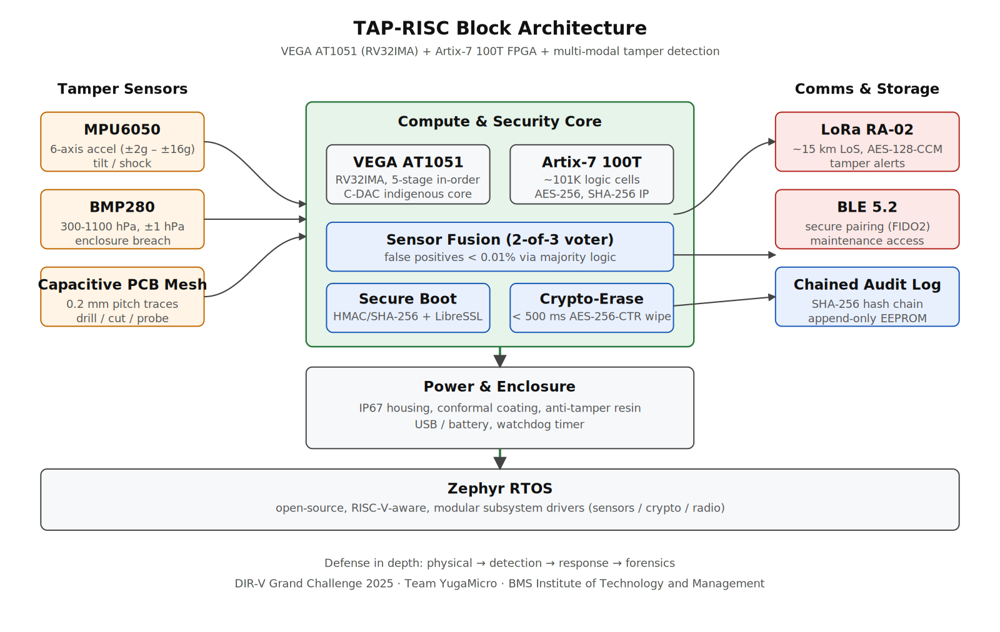
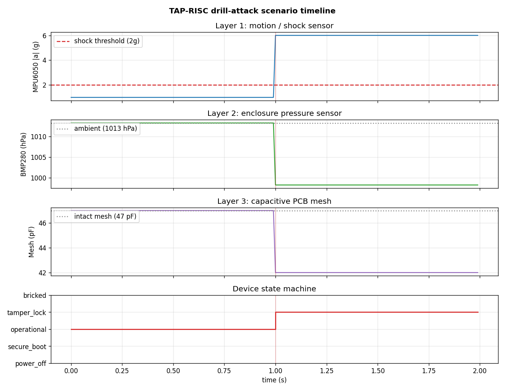

<div align="center">

# TAP-RISC
### Tamper-Aware Portable RISC-V Edge Platform


**India's first concept of an indigenous tamper-aware RISC-V edge platform
for defense and critical IoT - selected as a Quarterfinalist in C-DAC's
[DIR-V Grand Challenge 2025](https://www.pib.gov.in/PressReleasePage.aspx?PRID=2113411).**

</div>

---

## Overview

TAP-RISC is a security platform concept built around **C-DAC's
VEGA AT1051** RISC-V CPU (RV32IMA, 5-stage pipeline) hosted on a
**Xilinx Artix-7 100T** FPGA. It addresses a real gap in Indian
defense and critical-infrastructure electronics: most secure
electronics in the country today are either **expensive and
closed-source** (Thales Luna HSM: ~₹1,00,000+ per unit) or
**passively hardened** (BEL critical-infra systems) with no real-time
tamper response.

TAP-RISC turns that around with **autonomous active defense**:

- **Multi-modal physical tamper detection** — accelerometer + barometer
  + capacitive PCB mesh, fused with 2-of-3 majority voting (<0.01%
  false-positive target).
- **<500 ms autonomous crypto-erase** — AES-256-CTR three-pass purge
  of all key material the instant tampering is confirmed.
- **Tamper-evident chained audit log** — every event hashed with
  SHA-256 into an append-only chain; silent edits invalidate the
  chain.
- **Encrypted long-range alerting** — LoRa RA-02 (15 km LoS) +
  BLE 5.2 for maintenance pairing.
- **Open and reproducible** — VEGA core + Zephyr RTOS + this MIT-licensed
  reference design. **~₹10,000 BOM** vs ₹1,00,000+ for imports.



## ⚠️ Project status — please read

**This is a conceptual project with a working software simulator.** It
was developed as a DIR-V Grand Challenge 2025 submission and earned
**quarterfinalist** standing on the strength of the design. 
(see [`docs/roadmap.md`](docs/roadmap.md)).

What this repository contains:

| ✅ Included | 🔲 Not yet |
|---|---|
| Complete system architecture and design docs | RTL / HDL for the Artix-7 fabric |
| Threat model and attack-defense walkthroughs | Zephyr port to the VEGA AT1051 |
| Hardware BOM with itemized costing | Physical prototype (PCB, sensors, enclosure) |
| Comparative analysis vs Thales / BEL / NEC | Field testing |
| **Working Python simulator** (sensors + crypto + state machine) | Real-world tamper-response measurement |
| 5 attack scenarios + 19 unit tests | |

## Repository layout

```
tap-risc/
├── README.md                            <- you are here
├── LICENSE
├── docs/
│   ├── architecture.md                  <- subsystem-by-subsystem design
│   ├── threat-model.md                  <- adversary capabilities + 10 attack scenarios
│   ├── comparative-analysis.md          <- TAP-RISC vs Thales / BEL / NEC
│   ├── hardware-bom.md                  <- prototype and production-volume costing
│   ├── roadmap.md                       <- Q3 2025 → Q2 2026 milestones
│   ├── attack-defense-walkthrough.md    <- step-by-step layered defense
│   └── images/
│       ├── architecture.png
│       └── scenario_timeline.png
│
├── simulator/                           <- working Python reference implementation
│   ├── sensors.py                       <- MPU6050 / BMP280 / capacitive mesh models
│   ├── security.py                      <- secure boot / crypto-erase / chained log
│   ├── communication.py                 <- LoRa + BLE channel models
│   ├── device.py                        <- TAPRISCDevice state machine
│   ├── threat_scenarios.py              <- 5 end-to-end attack/defense walkthroughs
│   ├── tests/                           <- 19 unit tests
│   ├── requirements.txt
│   └── README.md
│
├── proposal/                            <- original DIR-V Grand Challenge materials
│   ├── DIR-V-2025-Proposal.md
│   └── pitch-deck-summary.md
│
└── scripts/
    ├── visualize_scenario.py            <- timeline plot of a drill attack
    └── draw_architecture.py             <- generates the architecture SVG / PNG
```

## Quick start

The simulator has **zero required dependencies** - it runs on stdlib
Python 3.10+.

```bash
# Clone the repo
git clone https://github.com/YOUR-USER/tap-risc.git
cd tap-risc

# Run the threat-scenario suite (5 attack/defense walkthroughs)
python -m simulator.threat_scenarios

# Run the unit tests (19 tests, all passing)
python -m unittest discover simulator/tests -v

# Optional: regenerate the timeline visualization
pip install matplotlib
python scripts/visualize_scenario.py
```

Expected output of the threat-scenario suite:

```
[PASS] Drill attack
[PASS] Voltage glitch only
[PASS] Single-sensor noise
[PASS] Firmware injection
[PASS] Log tamper
```

## A tamper event, end-to-end

This is the timeline of a simulated drill attack — three sensors fire,
the fusion voter confirms, the key store wipes in microseconds, and
the device transitions to the `tamper_lock` state:



The corresponding audit log (SHA-256 chained, tamper-evident):

```
#0000 t=0.000s event=POWER_ON   detail='TAPRISC-001'
#0001 t=0.000s event=BOOT_OK    detail='fw=v0.1.0'
#0002 t=1.000s event=TAMPER     detail='channels=mpu6050+mesh'
#0003 t=1.000s event=WIPE       detail='duration_ms=0.0'
#0004 t=1.000s event=ALERT_TX   detail='channel=lora received=True'
```

## Key design decisions

| Decision | Rationale |
|---|---|
| **VEGA AT1051 (C-DAC) for the CPU** | Indigenous RISC-V IP, aligned with DIR-V mandate; in-order pipeline gives predictable timing for watchdog deadlines. |
| **Artix-7 100T for fabric crypto** | Built-in AES-256 + SHA-256 IP blocks; ~101k logic cells host both the soft CPU and the custom tamper peripherals. |
| **3 sensors, 2-of-3 voting** | Single-mode tamper detection has unacceptable false-positive rates. Voting drops FP to <0.01% without sacrificing real-attack sensitivity. |
| **HMAC-SHA256 secure boot (not ECDSA)** | Faster on a 5-stage in-order core, smaller code footprint, identical adversarial security under our threat model. |
| **AES-256-CTR for crypto-erase pattern** | NIST SP 800-88 three-pass purge: random / complement / zeros — defeats memory remanence on SRAM-backed key stores. |
| **SHA-256 chained audit log** | Blockchain-style chaining makes silent log editing detectable post-hoc, without needing online connectivity. |
| **LoRa for the alert channel** | 15 km LoS range means alerts work in deployment scenarios (border posts, remote substations) where cellular fails. |

## Comparative numbers

| System | Unit cost (INR) | Tamper response | Field deployable | Open / RISC-V |
|---|---|---|---|---|
| Thales Luna HSM (network) | ~₹1,00,000+ | Policy-based, manual recovery | Limited | No |
| BEL Critical Infra Radar | ~₹50,00,000 | None (physical hardening only) | Fixed install | No |
| **TAP-RISC (this design)** | **~₹10,000** | **Autonomous wipe + alert in <500 ms** | **Yes (portable, IP67)** | **Yes** |

See [`docs/comparative-analysis.md`](docs/comparative-analysis.md) for
the per-capability breakdown.


